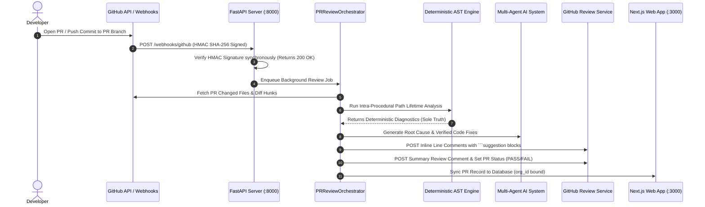

# 🛡️ LEAKGUARD: COMPLETE MASTER PROJECT DOCUMENTATION & TECHNICAL GUIDE

---

## 📌 1. Project Overview & Core Philosophy

**LeakGuard** is a commercial-grade static resource lifetime analysis platform and AI-driven pull request review engine designed specifically for Python codebases.

### The Problem Solved
Resource leaks (unclosed database handles, sockets, subprocesses, thread locks, file handles, HTTP sessions, and temporary files) cause production crashes, connection pool exhaustion, memory leaks, and severe security vulnerabilities.

### The LeakGuard Architecture Solution
LeakGuard uses a **Dual-Engine Architecture**:
1. **100% Deterministic AST Core (Sole Authority)**: Built on standard library Python `ast` and Control-Flow Graph (CFG) intra-procedural path dataflow solvers. It statically analyzes code **without ever executing target source code** (0% false-positive LLM hallucinations on leak detection).
2. **AI Multi-Agent & CodeRabbit PR Review Engine**: Generates plain-language root cause analyses, security impact metrics, and candidate cleanup fixes.
3. **Isolated AST Sandbox Patch Validator**: Candidate AI fixes are **never trusted automatically**. Every fix candidate is applied in a temporary memory workspace and re-analyzed by the deterministic LeakGuard engine. Only patches that clear the original leak without introducing new findings receive the `VERIFIED_FIX` status.

---

## 🗺️ 2. Comprehensive Code Map & Component Directory

Below is the complete breakdown of **where every feature and component lives in the codebase**:

```
c:\LeakGaurd\
├── PROJECT_MASTER_DOCUMENTATION.md     # Master documentation & presentation guide
├── README.md                            # High-level repository landing page
│
├── core\                                # 🎯 100% Deterministic AST Static Engine
│   ├── analysis\                        # Core Analysis Engine & Project Scanner
│   │   ├── engine.py                    # AnalysisEngine (file-level AST analysis driver)
│   │   ├── scanner.py                   # ProjectScanner (directory-level multi-threaded scanner)
│   │   └── what_if.py                   # Static Hypothetical Exception Simulator
│   ├── ast\                             # Python AST Visitors & Collectors
│   │   ├── visitor.py                   # AST NodeVisitor for functions, try/except, with, call
│   │   └── collector.py                 # Resource acquisition and release site collector
│   ├── cfg\                             # Control Flow Graph Builder
│   │   ├── builder.py                   # Constructs Basic Blocks & CFG Directed Edges
│   │   └── model.py                     # BasicBlock & ControlFlowEdge definitions
│   ├── common\                          # Shared Data Models & Enums
│   │   ├── models.py                    # Diagnostic, Classification, Span, SourceLocation, ScanResult
│   │   └── config.py                    # LeakGuardConfig rules and thresholds
│   ├── dataflow\                        # Intra-procedural Path Dataflow Solver
│   │   ├── solver.py                    # Fixed-point worklist dataflow solver
│   │   └── lattice.py                   # Resource State Transition Lattice (UNACQUIRED->OPEN->CLOSED/LEAKED)
│   ├── ownership\                       # Resource Ownership Graph Builder
│   │   └── graph.py                     # OwnershipGraph (Creates, Transfers, Escapes)
│   ├── parser\                          # Safe Python AST Parser
│   │   └── parser.py                    # stdlib ast.parse wrapper with span/depth validation
│   ├── resources\                       # Resource Signatures & Catalog
│   │   ├── catalog.py                   # Catalog of DB, Socket, File, Subprocess, Lock signatures
│   │   └── signatures.py                # Signature matching rules
│   ├── risk\                            # Deterministic Risk Scoring Formula
│   │   └── scorer.py                    # Bounded 0-100 Risk Scoring Engine
│   └── rules\                           # Static Analysis Security Rules
│       ├── base.py                      # Rule base class
│       └── definitions.py               # Rules LEAK_001 through LEAK_008
│
├── services\                            # 🧠 Business Logic, AI Agents, & Integrations
│   ├── ai\                              # Multi-Agent AI Subsystem & Sandbox Validator
│   │   ├── agents\                      # Specialized AI Agents
│   │   │   ├── pr_review_agent.py       # PRReviewAgent (Formats inline PR comments & summary)
│   │   │   ├── reviewer.py              # CodeReviewerAgent (Qualitative security analysis)
│   │   │   ├── root_cause.py            # RootCauseAgent (Execution path leak analyzer)
│   │   │   ├── fix_gen.py               # FixGeneratorAgent (ContextManager/TryFinally fix synthesizer)
│   │   │   ├── hunter.py                # ResourceHunterAgent (Resource acquisition tracker)
│   │   │   └── verifier.py              # VerificationAgent (Patch safety inspector)
│   │   ├── auto_fixer.py                # AutoFixerEngine (Generates & verifies strategy fixes)
│   │   ├── orchestrator.py              # Multi-agent workflow orchestrator
│   │   ├── prompts.py                   # Structured LLM prompt templates
│   │   ├── redactor.py                  # SecretRedactor (Scrubs API keys/passwords before LLM prompts)
│   │   ├── remediator.py                # AIRemediator for single-file patch generation
│   │   ├── tracer.py                    # LangFuse execution & token metrics tracer
│   │   └── validator.py                 # Isolated AST Sandbox 9-step Patch Validator
│   │
│   ├── github_pr\                       # 🤖 CodeRabbit-Style GitHub PR Engine
│   │   ├── comment_builder.py           # Builds markdown inline review comments & PR summary
│   │   ├── inline_mapper.py            # Maps AST line numbers to Git diff hunk positions
│   │   ├── orchestrator.py              # PRReviewOrchestrator (PR Webhook -> AST -> AI -> GitHub post)
│   │   └── risk_scorer.py               # Composite PR Risk Scorer (0-100)
│   │
│   ├── saas\                            # SaaS Sync Subsystem
│   │   └── sync.py                      # Uploads findings metadata to SaaS backend
│   │
│   └── voice\                           # 🎙️ System Voice Audio Engine
│       └── announcer.py                 # Windows SAPI / pyttsx3 TTS Announcer
│
├── packages\                            # 📦 Web Backend & Shared Libraries
│   ├── github\                          # Standardized GitHub API Client
│   │   ├── auth.py                      # GitHub App & Personal Access Token Auth
│   │   ├── client.py                    # GitHubClient HTTP Client (REST & GraphQL)
│   │   └── services\                    # GitHub Sub-services
│   │       ├── commit.py                # GitHubCommitService (Creates commits directly on PR branch)
│   │       ├── pull_request.py          # GitHubPullRequestService (Fetches PR files & diffs)
│   │       ├── repository.py            # GitHubRepositoryService (Connects repos & sets webhooks)
│   │       ├── review.py                # GitHubReviewService (Posts inline comments & PR reviews)
│   │       └── webhook.py               # GitHubWebhookService (HMAC SHA-256 signature verification)
│   │
│   └── saas\                            # ⚡ FastAPI Commercial Control Plane Backend
│       ├── app.py                       # FastAPI application entry point (binds routers & CORS)
│       ├── config.py                    # Settings & env variable configuration
│       ├── db\                          # Database Subsystem
│       │   ├── database.py              # SQLAlchemy Async Engine & Session Local Helper
│       │   └── models.py                # DB Models: User, Org, Repo, PRScan, Finding, FixCandidate
│       └── routers\                     # API Endpoint Controllers
│           ├── auth.py                  # User Login, Signup, & Token Refresh endpoints
│           ├── github_pr.py             # PR listing, details, 1-Click Fix & Commit endpoints
│           ├── scans.py                 # Local CLI scan upload ingestion endpoint
│           └── webhooks.py              # GitHub POST /webhooks/github endpoint
│
├── presentation\                        # 🎨 User Interfaces
│   ├── dashboard\                       # 🌐 Next.js 14 Frontend Web Application
│   │   └── src\
│   │       ├── app\                     # Next.js App Router
│   │       │   ├── dashboard\           # Overview metrics page
│   │       │   ├── pull-requests\       # PR listing page (`/pull-requests`)
│   │       │   │   └── [id]\            # PR Detail Page (`/pull-requests/[id]`) with 1-Click Fix
│   │       │   └── login\               # User login & register modal
│   │       ├── components\              # React Components (Sidebar, PRStatusBadge, FindingCard)
│   │       └── lib\                     # API Client (`api.ts`) connecting Next.js to FastAPI
│   ├── json\                            # JSON Exporter (`exporter.py`)
│   ├── sarif\                           # SARIF 2.1.0 Specification Exporter (`exporter.py`)
│   └── terminal\                        # Rich Terminal Formatter & Live Radar UI (`formatter.py`)
│
└── interfaces\                          # 💻 CLI & Integration Wrappers
    ├── cli\                             # Typer CLI Command Handlers
    │   ├── main.py                      # Main Router (`leakguard scan`, `pr`, `init`, `login`, `server`)
    │   ├── review.py                    # CLI controllers (`review`, `explain`, `fix`, `verify`)
    │   ├── watch.py                     # Real-time Terminal Monitor (`watch`)
    │   ├── phase16_cli.py               # CLI controllers (`risk`, `ownership`, `what-if`)
    │   └── firewall_cli.py             # CLI controllers (`firewall`, `pr-diff`)
    ├── github_action\                   # Custom GitHub Action Metadata (`action.yml`)
    └── precommit\                       # Pre-commit Hook Wrapper
```

---

## ⚡ 3. How the 3 Core Workflows Operate (Step-by-Step)

### 🔄 Workflow A: Automated GitHub PR Webhook & Review Lifecycle


---

### ⚡ Workflow B: 1-Click Apply Fix & Commit Button Mechanics

#### Step 1: Fix Generation & Isolated AST Sandbox Testing
When a developer or reviewer clicks **`[🤖 Generate AI Fix]`** on the Web Dashboard:
1. LeakGuard AI generates candidate cleanup code (e.g. `with sqlite3.connect(...) as conn:`).
2. The candidate fix is passed to **`services/ai/validator.py` (PatchValidator)**.
3. PatchValidator creates a temporary in-memory isolated workspace and runs `AnalysisEngine.analyze_file()` on the candidate code.
4. **Validation Check**:
   - Is original leak cleared? $\rightarrow$ **YES**
   - Are zero new leaks introduced? $\rightarrow$ **YES**
   - Is syntax 100% valid? $\rightarrow$ **YES**
5. Dashboard displays **`✅ VERIFIED_FIX`** badge alongside unified diff preview.

#### Step 2: 1-Click Commit directly on GitHub Branch
When the user clicks **`[⚡ Apply Fix & Commit]`**:
1. Dashboard sends POST request to `/api/v1/github/prs/{pr_scan_id}/findings/{finding_id}/commit`.
2. Backend calls `GitHubCommitService.create_or_update_file()`.
3. GitHub API creates a new **Git Commit** directly on the PR branch on GitHub:
   - **Commit Message**: `fix(leakguard): apply verified context_manager cleanup for database connection`
   - **Author**: `LeakGuard Bot <leakguard-bot@noreply.leakguard.io>`

#### Step 3: Automated PR Re-scan
1. Direct commit on GitHub branch triggers a new `synchronize` webhook back to LeakGuard.
2. LeakGuard re-scans the PR, confirms zero remaining leaks, updates PR status from `FAIL ❌` to `PASS ✅`, and resolves the issue automatically!

---

### 🎙️ Workflow C: Local Pre-Push Shield with Live Voice Audio
When developer runs `git push`:
1. Installed Git Pre-Push Hook (`.git/hooks/pre-push`) runs:
   `python -m leakguard scan . --format json --voice`
2. If zero leaks found:
   - Terminal prints: `[OK] LeakGuard Pre-Push Check Passed! Zero blocking leaks detected.`
   - Voice Announcer speaks: *"LeakGuard pre push check passed. Zero resource leaks detected."*
   - Push completes successfully.
3. If unclosed leaks found:
   - Terminal prints red warning box with file locations.
   - Voice Announcer speaks: *"Attention! LeakGuard pre push firewall blocked unclosed resource leaks. Git push aborted."*
   - `exit 1` stops `git push` before unsafe code leaves local machine.

---

## 🛠️ 4. Full CLI Command Code Mapping Table

| Command | File Path | Function Name | Purpose & Execution Flow |
| :--- | :--- | :--- | :--- |
| `scan` | [interfaces/cli/main.py](file:///c:/LeakGaurd/interfaces/cli/main.py#L43) | `scan()` | Scans files/directories statically; outputs SARIF/JSON/text; supports voice audio & baselines. |
| `pr` | [interfaces/cli/main.py](file:///c:/LeakGaurd/interfaces/cli/main.py#L1155) | `pr_review_cmd()` | Runs PR review locally or against GitHub API; posts comments & terminal rich summary table. |
| `watch` | [interfaces/cli/watch.py](file:///c:/LeakGaurd/interfaces/cli/watch.py#L26) | `run_watch_mode()` | Continuous file monitoring; debounces saves (300ms); renders live terminal Resource Radar. |
| `review` | [interfaces/cli/review.py](file:///c:/LeakGaurd/interfaces/cli/review.py#L21) | `run_review_cmd()` | AI-assisted code review on target directory, PR, or commit SHA. |
| `explain` | [interfaces/cli/review.py](file:///c:/LeakGaurd/interfaces/cli/review.py#L99) | `run_explain_cmd()` | Generates AI root cause explanation and security risk breakdown for a finding. |
| `fix` | [interfaces/cli/review.py](file:///c:/LeakGaurd/interfaces/cli/review.py#L144) | `run_fix_cmd()` | Synthesizes AI fix and runs AST Sandbox verification before writing to file. |
| `verify` | [interfaces/cli/review.py](file:///c:/LeakGaurd/interfaces/cli/review.py#L214) | `run_verify_cmd()` | Verifies a patch file or candidate code against deterministic static rules. |
| `firewall` | [interfaces/cli/firewall_cli.py](file:///c:/LeakGaurd/interfaces/cli/firewall_cli.py#L16) | `run_firewall_cmd()` | Evaluates developer firewall policy rules (PASS/BLOCK). |
| `pr-diff` | [interfaces/cli/firewall_cli.py](file:///c:/LeakGaurd/interfaces/cli/firewall_cli.py#L84) | `run_pr_diff_cmd()` | Compares leak findings between two git refs (`before` vs `after`). |
| `risk` | [interfaces/cli/phase16_cli.py](file:///c:/LeakGaurd/interfaces/cli/phase16_cli.py#L137) | `run_risk_cmd()` | Computes bounded 0-100 risk score based on resource weights & control flow path. |
| `ownership` | [interfaces/cli/phase16_cli.py](file:///c:/LeakGaurd/interfaces/cli/phase16_cli.py#L28) | `run_ownership_cmd()` | Displays AST/CFG Resource Ownership Graph (Creates, Transfers, Escapes). |
| `what-if` | [interfaces/cli/phase16_cli.py](file:///c:/LeakGaurd/interfaces/cli/phase16_cli.py#L96) | `run_what_if_cmd()` | Static hypothetical exception simulator unwinding stack at target line number. |
| `init` | [interfaces/cli/main.py](file:///c:/LeakGaurd/interfaces/cli/main.py#L403) | `init()` | Initializes project config (`.leakguard.yml`), report dir, `.gitignore`, & Git hooks. |
| `install` | [interfaces/cli/main.py](file:///c:/LeakGaurd/interfaces/cli/main.py#L730) | `install()` | Installs pre-push hooks & opens web authentication portal callback. |
| `activate` | [interfaces/cli/main.py](file:///c:/LeakGaurd/interfaces/cli/main.py#L737) | `activate()` | Activates pre-push shield & opens web authentication portal callback. |
| `github connect` | [interfaces/cli/main.py](file:///c:/LeakGaurd/interfaces/cli/main.py#L934) | `github_connect()` | Connects GitHub repository to backend and displays webhook setup details. |
| `github test` | [interfaces/cli/main.py](file:///c:/LeakGaurd/interfaces/cli/main.py#L986) | `github_test()` | Sends HMAC-signed ping event to backend webhook endpoint. |
| `server` | [interfaces/cli/main.py](file:///c:/LeakGaurd/interfaces/cli/main.py#L194) | `server()` | Launches FastAPI Commercial Control Plane API server on port 8000. |
| `dashboard` | [interfaces/cli/main.py](file:///c:/LeakGaurd/interfaces/cli/main.py#L746) | `dashboard()` | Launches Next.js Commercial Web Dashboard on port 3000. |
| `login` / `logout` | [interfaces/cli/main.py](file:///c:/LeakGaurd/interfaces/cli/main.py#L323) | `login()` / `logout()`| Authenticates CLI session and manages token storage (`~/.leakguard/credentials.json`). |

---

## 🎤 5. Script & Presentation Talking Points for Evaluators / Judges

When presenting LeakGuard to evaluators or technical judges, use these bullet points:

1. **"Dual-Engine Hybrid Architecture"**:
   > *"Most tools either rely on pure regex linters (which miss complex exception paths) or pure LLMs (which hallucinate false leaks). LeakGuard combines 100% deterministic Python AST CFG path analysis as the sole authority on leak detection with an AI orchestration layer for root cause analysis."*

2. **"Authoritative AST Sandbox Verification"**:
   > *"LeakGuard never trusts AI patches blindly. Every AI-generated fix is applied in an isolated temporary memory workspace and re-scanned by the deterministic AST engine. Only fixes that clear the leak with zero new findings get marked VERIFIED_FIX."*

3. **"1-Click Fix & Commit Workflow"**:
   > *"Reviewers can apply verified fixes directly from the Web Dashboard or GitHub PR comments with one click. LeakGuard uses the GitHub API to commit the fix directly to the PR branch and triggers an automatic re-scan."*

4. **"Zero Customer Code Execution"**:
   > *"Unlike dynamic profilers or runtime monkey-patchers, LeakGuard operates 100% statically. It parses abstract syntax trees without ever executing customer source code or importing untrusted modules."*

5. **"Shift-Left Security & Live Voice Shield"**:
   > *"With `leakguard activate`, developers get local pre-push git shields with real-time voice audio announcements that block leaks before code ever reaches remote repositories."*
