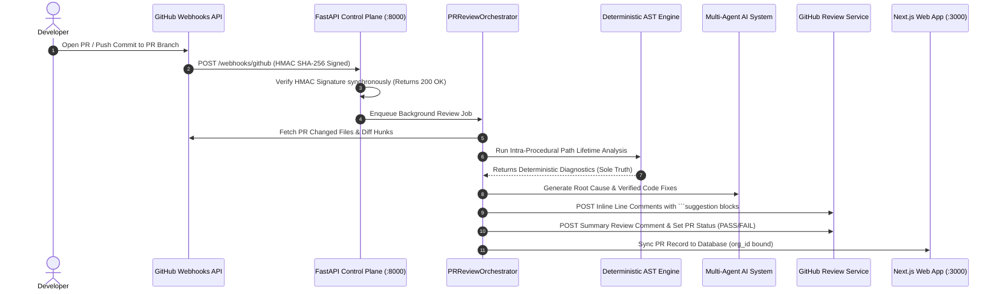
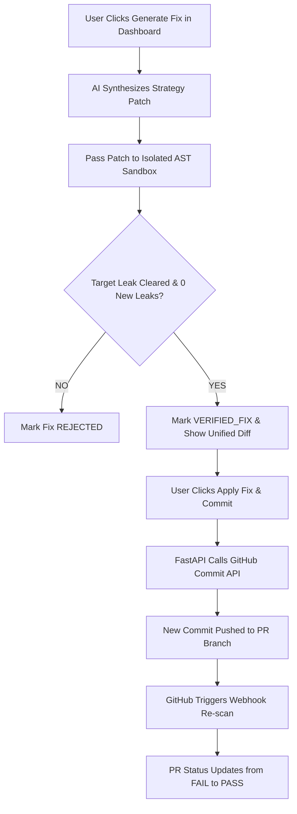
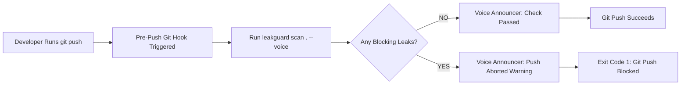

# 🛡️ LEAKGUARD: Commercial Static Resource Lifetime Analyzer & AI PR Review Engine

<p align="center">
  
  
  
  
  
</p>

---

## 📌 Executive Overview

**LeakGuard** is an enterprise-grade static analysis and AI code review platform built to eliminate **resource leaks** (unclosed database connections, sockets, files, HTTP sessions, locks, subprocesses, and temporary files) across Python codebases.

Unlike dynamic profilers or generic LLM code reviewers, LeakGuard combines **100% offline, deterministic AST/CFG dataflow analysis** with a **CodeRabbit-style GitHub PR review engine**. The deterministic static analyzer acts as the **sole authority on resource leak detection** (zero false-positive hallucinations on leak identification), while the AI layer generates detailed root-cause analyses, security impact assessments, and candidate code fixes that are **rigorously verified inside an isolated AST sandbox** before human approval.

---

## 🚀 5 Game-Changing Standout Features

### 1. ⚡ 1-Click "Apply Fix & Commit to PR" (GitHub & Web Dashboard)
- **GitHub PR Inline Comments**: Findings include native GitHub ````suggestion` code blocks so developers can click `[Commit suggestion]` directly inside GitHub.
- **Next.js Web Dashboard (`/pull-requests/[id]`)**: Features an interactive **`[⚡ Apply Fix & Commit]`** button. Clicking it generates an AI candidate patch, tests it in the **9-Step Isolated AST Sandbox**, and creates a Git commit directly on the PR branch on GitHub via API!

### 2. 🎯 100% Deterministic AST + AI Sandbox (Zero Hallucinations)
- **Sole Source of Truth**: Built using Python's standard library `ast` parser and Control-Flow Graph (CFG) intra-procedural path dataflow solvers.
- **Zero Customer Code Execution**: Analyzes code statically without importing or executing user source files.
- **Isolated AST Sandbox**: Every AI fix candidate is re-analyzed in a temporary memory workspace and receives `VERIFIED_FIX` **only** if the target leak is cleared with 0 new leaks introduced.

### 3. 🎙️ Pre-Push Shield with Live Voice Audio Warnings
- Configured via `leakguard activate .`.
- Runs a 3-second static scan before `git push`. If leaks are found, the system Voice Audio engine announces:
  > *"Attention! LeakGuard pre push firewall blocked unclosed resource leaks. Git push aborted."*
  and aborts `git push` before unsafe code leaves the developer's laptop!

### 4. 🔬 "What-If" Static Exception Simulator & Resource Ownership Graph
- **What-If Exception Simulator** (`leakguard what-if --file app.py --line 45`): Statically unwinds execution paths to test if an exception at a specific line leaves resources unclosed (`GUARANTEED` vs `NOT GUARANTEED`).
- **Resource Ownership Graph** (`leakguard ownership app.py`): Visualizes resource acquisitions, scope ownership (`OWNS`), transfers, and escapes.

### 5. 📊 Real-Time Multi-Tenant CodeRabbit PR Review Web Dashboard
- Next.js 14 Web Application (`http://localhost:3000/pull-requests`) with live Bounded Risk Meters (0–100), finding breakdown, live GitHub source preview, and multi-tenant organization context (`org_id`).

---

## 🏗️ System Architecture & Workflow Diagrams

### 🔄 1. Automated GitHub PR Webhook & Review Lifecycle


---

### ⚡ 2. 1-Click Apply Fix & Commit Mechanism


---

### 🛡️ 3. Pre-Push Shield & Live Voice Audio Guardrail


---

## 🧮 Mathematical Formulations & Technical Foundations

### 1. Fixed-Point Dataflow Solver Equations
For each basic block $B$ in function $F$:

$$\text{IN}[B] = \bigcup_{P \in \text{Pred}(B)} \text{OUT}[P]$$

$$\text{OUT}[B] = \text{gen}(B) \cup (\text{IN}[B] \setminus \text{kill}(B))$$

Where:
- $\text{gen}(B)$: Resource acquisitions introduced in block $B$ (e.g. `conn = sqlite3.connect(...)`).
- $\text{kill}(B)$: Explicit resource release statements in block $B$ (e.g. `conn.close()`, or exiting a `with` block).

### 2. Resource Finite State Machine (FSM) Lattice
```
                 ┌────────────────┐
                 │  UNACQUIRED    │
                 └───────┬────────┘
                         │ (Resource Acquisition Call)
                         ▼
                 ┌────────────────┐
                 │ OPEN_MUST_CLOSE│
                 └───┬────────┬───┘
     (Explicit Close)│        │ (Path Exits Scope without Close)
                     ▼        ▼
       ┌────────────────┐  ┌────────────────┐
       │     CLOSED     │  │ LEAKED / MAYBE │
       └────────────────┘  └────────────────┘
```

### 3. Bounded 0–100 Risk Scoring Formula
$$\text{Risk Score} = \min\left(100, \sum_{i=1}^{N} \left( W_{\text{resource}}(i) \times M_{\text{severity}}(i) \times M_{\text{exposure}}(i) \right) \right)$$

- **Base Weights**: `DATABASE` (85), `SOCKET` (80), `SUBPROCESS` (75), `LOCK` (70), `HTTP` (65), `FILE` (50), `TEMPFILE` (40).
- **Severity Multipliers**: `CRITICAL` (1.2), `ERROR` (1.0), `WARNING` (0.7), `INFO` (0.4).
- **Exposure Multipliers**: `DEFINITE_LEAK` (1.0), `POTENTIAL_LEAK` (0.7), `SAFE` (0.0).

---

## 📂 Comprehensive Codebase Map & Directory Structure

```
c:\LeakGaurd\
├── core\                        # 🎯 Deterministic Static Analysis Subsystem (100% Offline AST Authority)
│   ├── analysis\                # AnalysisEngine & Scanner Pipeline (engine.py, scanner.py, what_if.py)
│   ├── ast\                     # Python AST Visitors & Collectors (visitor.py, collector.py)
│   ├── cfg\                     # Control Flow Graph Builder & Basic Blocks (builder.py, model.py)
│   ├── common\                  # Models, Data Enums & Config (models.py, config.py)
│   ├── dataflow\                # Path Dataflow Solver & State Lattice (solver.py, lattice.py)
│   ├── ownership\               # Resource Ownership Graph Visualizer (graph.py)
│   ├── parser\                  # Safe stdlib ast.parse wrapper & depth validator (parser.py)
│   ├── resources\               # Resource Catalog & Signature Matchers (catalog.py, signatures.py)
│   ├── risk\                    # Bounded 0-100 Deterministic Risk Scoring Formula (scorer.py)
│   └── rules\                   # Static Analysis Security Rules (LEAK_001 - LEAK_008)
│
├── services\                    # 🧠 Business Logic, AI Agents, & Integration Services
│   ├── ai\                      # Multi-Agent Orchestration & AST Sandbox Verification
│   │   ├── agents\              # Specialized AI Agents (pr_review_agent.py, reviewer.py, fix_gen.py, root_cause.py)
│   │   ├── auto_fixer.py        # Strategy-pattern Auto Fixer Engine
│   │   ├── orchestrator.py      # LangFuse Multi-Agent Task Pipeline Execution Engine
│   │   ├── redactor.py          # Automatic API Key & Secret Redaction Pre-processor
│   │   ├── remediator.py        # AIRemediator for single-file patch synthesis
│   │   └── validator.py         # Isolated AST Sandbox 9-Step Patch Validator
│   │
│   ├── github_pr\               # 🤖 CodeRabbit-Style GitHub PR Review Layer
│   │   ├── comment_builder.py   # Formats rich markdown inline diff & PR summary comments
│   │   ├── inline_mapper.py    # Maps AST findings to Git diff line numbers
│   │   ├── orchestrator.py      # PRReviewOrchestrator (PR fetch -> AST -> AI -> GitHub post)
│   │   └── risk_scorer.py       # Composite PR Risk Scoring Engine
│   │
│   └── voice\                   # 🎙️ System Voice Audio Engine
│       └── announcer.py         # Windows SAPI / pyttsx3 TTS Announcer
│
├── packages\                    # 📦 Reusable Libraries & SaaS Server Backend
│   ├── github\                  # Standardized GitHub REST & GraphQL API Client
│   │   ├── auth.py              # GitHub App Installation & Token Auth
│   │   ├── client.py            # GithubClient HTTP Client with Retry & Rate Limiting
│   │   └── services\            # Commit, Pull Request, Repository, Review, & Webhook Services
│   │
│   └── saas\                    # ⚡ FastAPI SaaS Server Backend
│       ├── app.py               # Main FastAPI Application Entry Point
│       ├── config.py            # Settings & Env Config
│       ├── db\                  # Database Models & SQLAlchemy Async Engine (models.py, database.py)
│       └── routers\             # API Controllers (auth.py, github_pr.py, scans.py, webhooks.py)
│
├── presentation\                # 🎨 User Interfaces
│   ├── dashboard\               # 🌐 Next.js 14 Commercial Web Application (`src/app/pull-requests/`)
│   ├── json\                    # JSON Exporter (`exporter.py`)
│   ├── sarif\                   # SARIF 2.1.0 Exporter (`exporter.py`)
│   └── terminal\                # Rich Terminal Formatter & Live Radar UI (`formatter.py`)
│
└── interfaces\                  # 💻 Execution Interfaces
    └── cli\                     # Typer CLI Router (`main.py`, `review.py`, `watch.py`, `phase16_cli.py`, `firewall_cli.py`)
```

---

## 💻 Full CLI Command Reference Table (25+ Commands)

| Command | Category | Description | Primary Options & Flags | Source Line Reference |
| :--- | :--- | :--- | :--- | :--- |
| `scan` | **Analysis** | Scans Python codebase statically for unclosed resource leaks across control flow paths. | `--format`, `--out`, `--fail-on`, `--voice`, `--baseline` | [interfaces/cli/main.py#L43](file:///c:/LeakGaurd/interfaces/cli/main.py#L43) |
| `pr` | **GitHub** | Runs full GitHub PR AI Code Review, posts inline PR comments & summary to GitHub. | `--repo`, `--voice`, `--token` | [interfaces/cli/main.py#L1155](file:///c:/LeakGaurd/interfaces/cli/main.py#L1155) |
| `watch` | **Live Monitor** | Live terminal file monitor and Resource Radar AST analysis telemetry. | `--debounce`, `--quiet`, `--voice`, `--json` | [interfaces/cli/watch.py#L26](file:///c:/LeakGaurd/interfaces/cli/watch.py#L26) |
| `review` | **AI Review** | Executes AI Resource Security Code Review on code, PRs, or commit SHAs. | `--mode`, `--pr`, `--commit`, `--json` | [interfaces/cli/review.py#L21](file:///c:/LeakGaurd/interfaces/cli/review.py#L21) |
| `explain` | **AI Analysis** | Provides root cause explanation and security vulnerability analysis for a finding. | `--finding`, `--file` | [interfaces/cli/review.py#L99](file:///c:/LeakGaurd/interfaces/cli/review.py#L99) |
| `fix` | **AI Auto-Fix** | Generates candidate AI cleanup patches and verifies them in AST sandbox. | `--finding`, `--strategy`, `--apply` | [interfaces/cli/review.py#L144](file:///c:/LeakGaurd/interfaces/cli/review.py#L144) |
| `verify` | **Verification** | Verifies a patch or modified file against deterministic LeakGuard analysis rules. | `--patch`, `--original` | [interfaces/cli/review.py#L214](file:///c:/LeakGaurd/interfaces/cli/review.py#L214) |
| `firewall` | **Policy Guard**| Evaluates developer firewall policy rules (`PASS` or `BLOCK`). | `--config`, `--strict`, `--json` | [interfaces/cli/firewall_cli.py#L16](file:///c:/LeakGaurd/interfaces/cli/firewall_cli.py#L16) |
| `pr-diff` | **Diff Engine** | Compares leak findings between two git refs or branches (`before` vs `after`). | `--before`, `--after`, `--pr`, `--json` | [interfaces/cli/firewall_cli.py#L84](file:///c:/LeakGaurd/interfaces/cli/firewall_cli.py#L84) |
| `risk` | **Security Scoring**| Computes deterministic 0–100 composite risk score for a target or finding. | `--finding`, `--json` | [interfaces/cli/phase16_cli.py#L137](file:///c:/LeakGaurd/interfaces/cli/phase16_cli.py#L137) |
| `ownership` | **AST Visualizer**| Displays Resource Ownership Graph (creates, transfers, escapes, handles). | `--finding`, `--json` | [interfaces/cli/phase16_cli.py#L28](file:///c:/LeakGaurd/interfaces/cli/phase16_cli.py#L28) |
| `what-if` | **Exception Sim**| Simulates static hypothetical exception unwinding at a specific line number. | `--file`, `--line`, `--json` | [interfaces/cli/phase16_cli.py#L96](file:///c:/LeakGaurd/interfaces/cli/phase16_cli.py#L96) |
| `init` | **Repo Setup** | Initializes `.leakguard.yml`, `.leakguard/reports/`, `.gitignore`, and Git hooks. | Target directory | [interfaces/cli/main.py#L403](file:///c:/LeakGaurd/interfaces/cli/main.py#L403) |
| `install` | **Installation**| Installs pre-push Git hooks and triggers Web Dashboard authentication callback. | Target directory | [interfaces/cli/main.py#L730](file:///c:/LeakGaurd/interfaces/cli/main.py#L730) |
| `activate` | **Activation** | Activates automated push protection and launches browser authentication portal. | Target directory | [interfaces/cli/main.py#L737](file:///c:/LeakGaurd/interfaces/cli/main.py#L737) |
| `github connect` | **Integration** | Registers a GitHub repository for webhook PR reviews. | `repo` (owner/repo), `--server` | [interfaces/cli/main.py#L934](file:///c:/LeakGaurd/interfaces/cli/main.py#L934) |
| `github test` | **Integration** | Tests backend GitHub webhook endpoint with HMAC signature ping. | `--server` | [interfaces/cli/main.py#L986](file:///c:/LeakGaurd/interfaces/cli/main.py#L986) |
| `server` | **Control Plane**| Launches FastAPI Commercial Control Plane API server (port 8000). | `--host`, `--port`, `--reload` | [interfaces/cli/main.py#L194](file:///c:/LeakGaurd/interfaces/cli/main.py#L194) |
| `dashboard` | **Web UI** | Launches Next.js Commercial Web Dashboard dev server (port 3000). | `--port` (default 3000) | [interfaces/cli/main.py#L746](file:///c:/LeakGaurd/interfaces/cli/main.py#L746) |
| `upload` | **SaaS Sync** | Transmits structured findings metadata to SaaS server (zero raw source upload). | `--repo`, `--url`, `--token` | [interfaces/cli/main.py#L206](file:///c:/LeakGaurd/interfaces/cli/main.py#L206) |
| `login` | **Auth** | Authenticates local CLI session with LeakGuard Control Plane server. | `--email`, `--password`, `--url` | [interfaces/cli/main.py#L323](file:///c:/LeakGaurd/interfaces/cli/main.py#L323) |
| `logout` | **Auth** | Removes stored local CLI credentials. | None | [interfaces/cli/main.py#L396](file:///c:/LeakGaurd/interfaces/cli/main.py#L396) |
| `benchmark` | **Testing** | Runs 300+ AST fixture benchmark suite for performance and accuracy verification. | None | [interfaces/cli/main.py#L187](file:///c:/LeakGaurd/interfaces/cli/main.py#L187) |
| `speak` | **Audio TTS** | Generates system Voice Audio announcements via TTS engine. | `message`, `--sync` | [interfaces/cli/main.py#L904](file:///c:/LeakGaurd/interfaces/cli/main.py#L904) |
| `version` | **Info** | Displays LeakGuard version and build metadata. | None | [interfaces/cli/main.py#L915](file:///c:/LeakGaurd/interfaces/cli/main.py#L915) |

---

## ⚡ Quickstart

### 1. Installation

```bash
# Clone repository
git clone https://github.com/ddevguru/VH26-OG-CODERS.git
cd VH26-OG-CODERS

# Install LeakGuard in editable mode
pip install -e .
```

### 2. 1-Command Local Guardrail Setup (`leakguard activate`)

Installs pre-push and pre-commit Git hooks and opens the Web Portal authentication modal:

```bash
leakguard activate .
```

Now, whenever you `git push`, LeakGuard automatically runs a static resource leak scan. If a leak is introduced, the push is safely blocked and announced via voice!

---

## 🛠️ GitHub Webhook & Actions Setup Guide

### 1. Webhook Setup
To enable automatic PR reviews for your repository:
1. Run `leakguard github connect owner/repo`.
2. Go to **GitHub Repository -> Settings -> Webhooks -> Add Webhook**.
3. Set **Payload URL**: `http://<your-server-or-ngrok-url>/webhooks/github`
4. Set **Content-Type**: `application/json`
5. Set **Secret**: Matches your `GITHUB_WEBHOOK_SECRET` env variable.
6. Select Event: **Pull Requests**.

### 2. GitHub Actions Workflow (`.github/workflows/leakguard.yml`)

```yaml
name: LeakGuard Resource Leak Scan

on:
  pull_request:
    branches: [ main, master ]

jobs:
  leakguard-scan:
    runs-on: ubuntu-latest
    steps:
      - uses: actions/checkout@v4

      - name: Set up Python
        uses: actions/setup-python@v5
        with:
          python-version: '3.12'

      - name: Install Dependencies
        run: |
          python -m pip install --upgrade pip
          pip install -e .

      - name: Run LeakGuard PR AI Review
        env:
          GITHUB_TOKEN: ${{ secrets.GITHUB_TOKEN }}
          OPENAI_API_KEY: ${{ secrets.OPENAI_API_KEY }}
        run: |
          python -m leakguard pr ${{ github.event.pull_request.number }} --repo ${{ github.repository }}
```

---

## 🎤 Presentation Script & Evaluator Talking Points

When presenting LeakGuard to evaluators or judges, use these 5 core talking points:

1. **"Dual-Engine Hybrid Architecture"**:
   > *"Most tools either rely on pure regex linters (which miss complex exception paths) or pure LLMs (which hallucinate false leaks). LeakGuard combines 100% deterministic Python AST CFG path analysis as the sole authority on leak detection with an AI orchestration layer for root cause analysis."*

2. **"Authoritative AST Sandbox Verification"**:
   > *"LeakGuard never trusts AI patches blindly. Every AI-generated fix is applied in an isolated temporary memory workspace and re-scanned by the deterministic AST engine. Only fixes that clear the leak with zero new findings get marked VERIFIED_FIX."*

3. **"1-Click Fix & Commit Workflow"**:
   > *"Reviewers can apply verified fixes directly from the Web Dashboard or GitHub PR comments with one click. LeakGuard uses the GitHub API to commit the fix directly to the PR branch and triggers an automatic re-scan."*

4. **"Zero Customer Code Execution"**:
   > *"Unlike dynamic profilers or runtime monkey-patchers, LeakGuard operates 100% statically. It parses abstract syntax trees without ever executing customer source code or importing untrusted modules."*

5. **"Shift-Left Security & Live Voice Shield"**:
   > *"With `leakguard activate`, developers get local pre-push git shields with real-time voice audio announcements that block leaks before code ever reaches remote repositories."*

---

## 🧪 Running Automated Unit Tests

```bash
# Run all unit tests
pytest tests/unit/test_github_*.py tests/unit/test_pr_*.py

# Run with coverage report
pytest --cov=core --cov=services --cov=interfaces tests/
```

---

## 📄 License

LeakGuard is released under the **MIT License**.
See `LICENSE` for more details.
