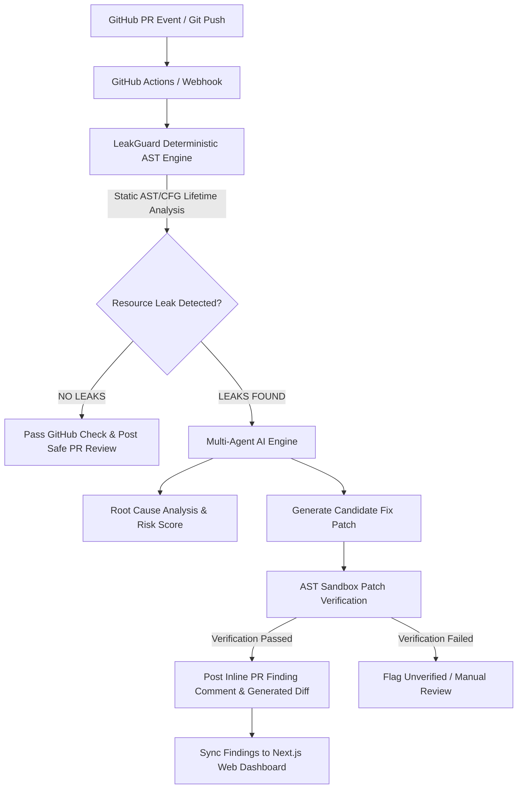

# 🛡️ LEAKGUARD

<p align="center">
  
  
  
  
  
</p>

---

## 📌 Executive Overview

**LeakGuard** is an enterprise-grade static analysis and AI code review platform built to eliminate **resource leaks** (unclosed database connections, sockets, files, HTTP sessions, locks, subprocesses, and temporary files) across Python codebases.

Unlike dynamic profilers or generic LLM code reviewers, LeakGuard combines **100% offline, deterministic AST/CFG dataflow analysis** with a **CodeRabbit-style GitHub PR review engine**. The deterministic static analyzer acts as the **sole authority on resource leak detection** (zero false-positive hallucinations on leak identification), while the AI layer generates detailed root-cause analyses, security impact assessments, and candidate code fixes that are **rigorously verified inside an isolated AST sandbox** before human approval.

---

## 🌟 Key Architecture & Capabilities



### 1. 🎯 100% Deterministic AST Authority
- Built strictly on Python's standard library `ast` and Control-Flow Graph (CFG) intra-procedural path dataflow solvers.
- **Zero source code execution**: Analyzes code statically without importing or executing user source files.
- **Zero AI Hallucination**: AI is **never** permitted to decide whether code leaks or is safe. The AST engine is the single source of truth.

### 2. 🤖 CodeRabbit-Style GitHub PR Review Engine
- **Automated PR Bot Reviews**: Listens to GitHub `pull_request` webhooks and automatically inspects changed files.
- **Line-Level Inline Comments**: Posts precise GitHub code review comments directly on the affected diff lines.
- **AI Root Cause & Diff Generation**: Explains *why* the leak occurs across complex exception branches and provides ready-to-apply diff patches.
- **GitHub Step Summaries**: Automatically generates formatted markdown reports in `$GITHUB_STEP_SUMMARY` for GitHub Actions.

### 3. 🔬 Isolated AST Sandbox Patch Verification
- Candidate AI fixes are **never trusted blindly**.
- Every generated fix is tested in an isolated AST sandbox:
  1. Patch is applied in a temporary memory workspace.
  2. The deterministic LeakGuard analyzer re-scans the patched file.
  3. Patch is marked `VERIFIED_FIX` **only** if the target leak is cleared **and 0 new leaks** are introduced.
- **Zero Auto-Commits**: AI cannot commit code without explicit human developer approval.

### 4. 📊 Multi-Tenant Commercial Web Dashboard
- Modern Next.js Web Dashboard on port 3000 linked to FastAPI SaaS control plane on port 8000.
- Live `/pull-requests` tab showing real-time PR review status, risk scores (0–100), and finding breakdown.
- Multi-organization support with automatic `org_id` context binding.

### 5. 📡 Real-Time Terminal Watcher (`leakguard watch`)
- Debounced live file monitor (`--debounce 300`) with incomplete syntax tolerance while typing.
- Terminal **Resource Lifecycle Radar** displaying acquisition, transfer, release, and exception escape paths.

---

## ⚡ Quickstart

### Installation

```bash
# Clone repository
git clone https://github.com/ddevguru/VH26-OG-CODERS.git
cd VH26-OG-CODERS

# Install LeakGuard in editable mode
pip install -e .
```

### 1-Command Local Guardrail Setup (`leakguard activate`)

Installs pre-push and pre-commit Git hooks and opens the Web Portal authentication modal:

```bash
leakguard activate .
```

Now, whenever you `git push`, LeakGuard automatically runs a static resource leak scan. If a leak is introduced, the push is safely blocked!

---

## 💻 Full CLI Command Reference

Below is the complete reference table of all `leakguard` CLI commands:

| Command | Category | Description | Primary Options & Flags | Example Usage |
| :--- | :--- | :--- | :--- | :--- |
| `scan` | **Analysis** | Scans Python codebase statically for unclosed resource leaks across control flow paths. | `--format` (text/json/sarif), `--out`, `--fail-on`, `--voice`, `--baseline`, `--changed-only` | `leakguard scan ./src --format sarif --out sarif.json` |
| `pr` | **GitHub** | Runs full GitHub PR AI Code Review, posts inline PR comments & summary to GitHub. | `--repo`, `--voice`, `--token` | `leakguard pr 4 --repo myorg/myrepo` |
| `watch` | **Live Monitoring** | Live terminal file monitor and Resource Radar AST analysis telemetry. | `--debounce`, `--quiet`, `--voice`, `--json` | `leakguard watch . --debounce 300` |
| `review` | **AI Review** | Executes AI Resource Security Code Review on code, PRs, or commit SHAs. | `--mode`, `--pr`, `--commit`, `--json` | `leakguard review . --mode detailed` |
| `explain` | **AI Analysis** | Provides root cause explanation and security vulnerability analysis for a finding. | `--finding`, `--file` | `leakguard explain --finding LEAK_001` |
| `fix` | **AI Auto-Fix** | Generates candidate AI cleanup patches and verifies them in AST sandbox. | `--finding`, `--strategy`, `--apply` | `leakguard fix sample.py --finding LEAK_001 --apply` |
| `verify` | **Verification** | Verifies a patch or modified file against deterministic LeakGuard analysis rules. | `--patch`, `--original` | `leakguard verify patch.diff --original app.py` |
| `firewall` | **Policy Guard** | Evaluates developer firewall policy rules (`PASS` or `BLOCK`). | `--config`, `--strict`, `--json` | `leakguard firewall . --strict` |
| `pr-diff` | **Diff Engine** | Compares leak findings between two git refs or branches (`before` vs `after`). | `--before`, `--after`, `--pr`, `--json` | `leakguard pr-diff --before main --after feature` |
| `risk` | **Security Scoring**| Computes deterministic 0–100 composite risk score for a target or finding. | `--finding`, `--json` | `leakguard risk .` |
| `ownership` | **AST Visualizer** | Displays Resource Ownership Graph (creates, transfers, escapes, handles). | `--finding`, `--json` | `leakguard ownership services/db.py` |
| `what-if` | **Exception Sim** | Simulates static exception unwinding at a specific line number without executing code. | `--file`, `--line`, `--json` | `leakguard what-if --file db.py --line 42` |
| `init` | **Repository Setup**| Initializes `.leakguard.yml`, `.leakguard/reports/`, `.gitignore`, and Git hooks. | Target directory | `leakguard init .` |
| `install` | **Installation** | Installs pre-push Git hooks and triggers Web Dashboard authentication callback. | Target directory | `leakguard install .` |
| `activate` | **Activation** | Activates automated push protection and launches browser authentication portal. | Target directory | `leakguard activate .` |
| `github connect` | **Integration** | Registers a GitHub repository for webhook PR reviews. | `repo` (owner/repo), `--server` | `leakguard github connect myorg/myrepo` |
| `github test` | **Integration** | Tests backend GitHub webhook endpoint with HMAC signature ping. | `--server` | `leakguard github test` |
| `server` | **Control Plane** | Launches FastAPI Commercial Control Plane API server. | `--host`, `--port` (default 8000), `--reload` | `leakguard server --port 8000` |
| `dashboard` | **Web UI** | Launches Next.js Commercial Web Dashboard dev server. | `--port` (default 3000) | `leakguard dashboard --port 3000` |
| `upload` | **SaaS Sync** | Transmits structured findings metadata to SaaS server (zero raw source upload). | `--repo`, `--url`, `--token`, `--org-id` | `leakguard upload . --repo myrepo --token $TOKEN` |
| `login` | **Auth** | Authenticates local CLI session with LeakGuard Control Plane server. | `--email`, `--password`, `--url` | `leakguard login` |
| `logout` | **Auth** | Removes stored local CLI credentials. | None | `leakguard logout` |
| `benchmark` | **Testing** | Runs 300+ AST fixture benchmark suite for performance and accuracy verification. | None | `leakguard benchmark` |
| `speak` | **Audio TTS** | Generates system Voice Audio announcements. | `message`, `--sync` | `leakguard speak "Resource leak detected"` |
| `version` | **Info** | Displays LeakGuard version and build metadata. | None | `leakguard version` |

---

## 🛠️ GitHub Webhook & Actions Setup Guide

### 1. Webhook Setup
To enable automatic PR reviews for your repository:
1. Run `leakguard github connect owner/repo`.
2. Go to **GitHub Repository -> Settings -> Webhooks -> Add Webhook**.
3. Set **Payload URL**: `http://<your-server-or-ngrok-url>/webhooks/github`
4. Set **Content-Type**: `application/json`
5. Set **Secret**: Matches your `GITHUB_WEBHOOK_SECRET` env variable.
6. Select Event: **Pull Requests**.

### 2. GitHub Actions Workflow (`.github/workflows/leakguard.yml`)

Add LeakGuard to your CI pipeline:

```yaml
name: LeakGuard Resource Leak Scan

on:
  pull_request:
    branches: [ main, master ]

jobs:
  leakguard-scan:
    runs-on: ubuntu-latest
    steps:
      - uses: actions/checkout@v4

      - name: Set up Python
        uses: actions/setup-python@v5
        with:
          python-version: '3.12'

      - name: Install Dependencies
        run: |
          python -m pip install --upgrade pip
          pip install -e .

      - name: Run LeakGuard PR AI Review
        env:
          GITHUB_TOKEN: ${{ secrets.GITHUB_TOKEN }}
          OPENAI_API_KEY: ${{ secrets.OPENAI_API_KEY }}
        run: |
          python -m leakguard pr ${{ github.event.pull_request.number }} --repo ${{ github.repository }}
```

---

## 📈 Bounded 0–100 Deterministic Risk Scoring (Phase 16)

LeakGuard uses an explicit formula to calculate resource leak risk without relying on AI:

$$\text{Risk Score} = \min\left(100, \sum_{\text{findings}} \left( W_{\text{resource}} \times M_{\text{severity}} \times M_{\text{exposure}} \right) \right)$$

### Base Weights by Category
- 🗄️ **DATABASE** = 85
- 🔌 **SOCKET** = 80
- ⚡ **SUBPROCESS** = 75
- 🔒 **LOCK** = 70
- 🌐 **HTTP_SESSION** = 65
- 📄 **FILE** = 50
- 📁 **TEMP_FILE** = 40

---

## 🧪 Running Unit Tests

```bash
# Run all unit tests
pytest tests/unit/test_github_*.py tests/unit/test_pr_*.py

# Run with coverage report
pytest --cov=core --cov=services --cov=interfaces tests/
```

---

## 📄 License

LeakGuard is released under the **MIT License**.
See `LICENSE` for more details.
