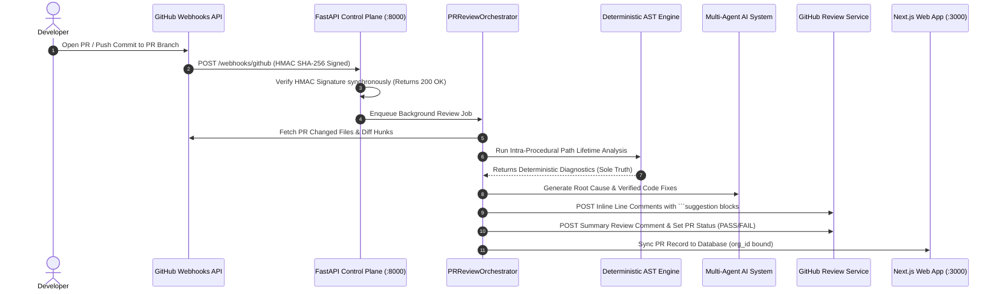
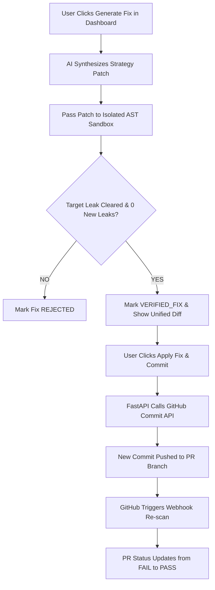
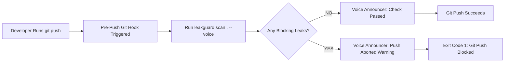

<div align="center">

# 🛡️ LEAKGUARD
### Commercial-Grade AST Static Resource Lifetime Scanner & CodeRabbit-Style AI PR Review Engine

```
  ____   ____  ____  ___  ____  _____ __  __   ____   ____   ____ 
 |  _ \ / __ \|  _ \|_ _||  _ \|  ___|  \/  | / ___| / __ \ |  _ \
 | |_) | |  | | |_) || | | |_) | |_  | |\/| || |  _ | |  | || |_) |
 |  __/| |__| |  _ < | | |  __/|  _| | |  | || |_| || |__| ||  _ < 
 |_|    \____/|_| \_\___||_|   |_|   |_|  |_| \____| \____/ |_| \_\
```

**Zero Source Code Execution • 100% Deterministic AST Authority • Isolated Patch Verification • Real-Time Voice Shield**

<br />

[](https://python.org)
[](#-core-architecture--dual-engine-philosophy)
[](#-5-game-changing-standout-features)
[](#-sarif-210--enterprise-ci-integration)
[](LICENSE)

</div>

---

## 📌 Executive Overview

**LeakGuard** is an enterprise-grade static analysis and AI code review platform built to eliminate **resource leaks** (unclosed database connections, sockets, files, HTTP sessions, locks, subprocesses, and temporary files) across Python codebases before code reaches production.

Unlike dynamic profilers or generic LLM code reviewers, LeakGuard combines **100% offline, deterministic AST/CFG dataflow analysis** with a **CodeRabbit-style GitHub PR review engine**. The deterministic static analyzer acts as the **sole authority on resource leak detection** (zero false-positive hallucinations on leak identification), while the AI layer generates detailed root-cause analyses, security impact assessments, and candidate code fixes that are **rigorously verified inside an isolated AST sandbox** before human approval.

---

## 🚀 5 Game-Changing Standout Features

<div align="center">

| Feature | Key Capability | Business & Developer Value |
| :--- | :--- | :--- |
| **⚡ 1-Click Fix & Commit** | Direct PR branch patch commit via GitHub API & Dashboard | Resolves vulnerabilities in 3 seconds without cloning code locally |
| **🎯 Dual-Engine Authority** | 100% AST Authority + 9-Step Isolated Sandbox Verification | **0% AI Hallucination** on leak detection & guaranteed safe patches |
| **🎙️ Live Voice Shield** | Windows SAPI & TTS Audio announcement guardrail | Blocks leaking `git push` attempts locally with real-time voice alerts |
| **🔬 What-If & Ownership** | Static exception unwinding & 3D ownership graph | Simulates stack unwinding (`GUARANTEED` vs `LEAKED`) without executing code |
| **📊 CodeRabbit PR Dashboard** | Next.js 14 Web Portal + Bounded Risk Meter (0–100) | Commercial-grade review metrics, audit trails, and multi-tenant isolation |

</div>

### 1. ⚡ 1-Click "Apply Fix & Commit to PR" (GitHub & Web Dashboard)
- **GitHub PR Inline Comments**: Findings include native GitHub ````suggestion` code blocks so developers can click `[Commit suggestion]` directly inside GitHub.
- **Next.js Web Dashboard (`/pull-requests/[id]`)**: Features an interactive **`[⚡ Apply Fix & Commit]`** button. Clicking it generates an AI candidate patch, tests it in the **9-Step Isolated AST Sandbox**, and creates a Git commit directly on the PR branch on GitHub via API!

### 2. 🎯 100% Deterministic AST + AI Sandbox (Zero Hallucinations)
- **Sole Source of Truth**: Built using Python's standard library `ast` parser and Control-Flow Graph (CFG) intra-procedural path dataflow solvers.
- **Zero Customer Code Execution**: Analyzes code statically without importing or executing user source files.
- **Isolated AST Sandbox**: Every AI fix candidate is re-analyzed in a temporary memory workspace and receives `VERIFIED_FIX` **only** if the target leak is cleared with 0 new leaks introduced.

### 3. 🎙️ Pre-Push Shield with Live Voice Audio Warnings
- Configured via `leakguard activate .`.
- Runs a 3-second static scan before `git push`. If leaks are found, the system Voice Audio engine announces:
  > *"Attention! LeakGuard pre push firewall blocked unclosed resource leaks. Git push aborted."*
  and aborts `git push` before unsafe code leaves the developer's laptop!

### 4. 🔬 "What-If" Static Exception Simulator & Resource Ownership Graph
- **What-If Exception Simulator** (`leakguard what-if --file app.py --line 45`): Statically unwinds execution paths to test if an exception at a specific line leaves resources unclosed (`GUARANTEED` vs `NOT GUARANTEED`).
- **Resource Ownership Graph** (`leakguard ownership app.py`): Visualizes resource acquisitions, scope ownership (`OWNS`), transfers, and escapes.

### 5. 📊 Real-Time Multi-Tenant CodeRabbit PR Review Web Dashboard
- Next.js 14 Web Application (`http://localhost:3000/pull-requests`) with live Bounded Risk Meters (0–100), finding breakdown, live GitHub source preview, and multi-tenant organization context (`org_id`).

---

## 🏗️ System Architecture & Workflow Diagrams

### 🔄 1. Automated GitHub PR Webhook & Review Lifecycle


---

### ⚡ 2. 1-Click Apply Fix & Commit Mechanism


---

### 🛡️ 3. Pre-Push Shield & Live Voice Audio Guardrail


---

## 🧮 Mathematical Formulations & Technical Foundations

### 1. Fixed-Point Dataflow Solver Equations
For each basic block $B$ in function $F$:

$$\text{IN}[B] = \bigcup_{P \in \text{Pred}(B)} \text{OUT}[P]$$

$$\text{OUT}[B] = \text{gen}(B) \cup (\text{IN}[B] \setminus \text{kill}(B))$$

Where:
- $\text{gen}(B)$: Resource acquisitions introduced in block $B$ (e.g. `conn = sqlite3.connect(...)`).
- $\text{kill}(B)$: Explicit resource release statements in block $B$ (e.g. `conn.close()`, or exiting a `with` block).

### 2. Resource Finite State Machine (FSM) Lattice
```
                 ┌────────────────┐
                 │  UNACQUIRED    │
                 └───────┬────────┘
                         │ (Resource Acquisition Call)
                         ▼
                 ┌────────────────┐
                 │ OPEN_MUST_CLOSE│
                 └───┬────────┬───┘
     (Explicit Close)│        │ (Path Exits Scope without Close)
                     ▼        ▼
       ┌────────────────┐  ┌────────────────┐
       │     CLOSED     │  │ LEAKED / MAYBE │
       └────────────────┘  └────────────────┘
```

### 3. Bounded 0–100 Risk Scoring Formula
$$\text{Risk Score} = \min\left(100, \sum_{i=1}^{N} \left( W_{\text{resource}}(i) \times M_{\text{severity}}(i) \times M_{\text{exposure}}(i) \right) \right)$$

- **Base Weights**: `DATABASE` (85), `SOCKET` (80), `SUBPROCESS` (75), `LOCK` (70), `HTTP` (65), `FILE` (50), `TEMPFILE` (40).
- **Severity Multipliers**: `CRITICAL` (1.2), `ERROR` (1.0), `WARNING` (0.7), `INFO` (0.4).
- **Exposure Multipliers**: `DEFINITE_LEAK` (1.0), `POTENTIAL_LEAK` (0.7), `SAFE` (0.0).

---

## 📂 Comprehensive Codebase Map & Directory Structure

```
c:\LeakGaurd\
├── core\                        # 🎯 Deterministic Static Analysis Subsystem (100% Offline AST Authority)
│   ├── analysis\                # AnalysisEngine & Scanner Pipeline (engine.py, scanner.py, what_if.py)
│   ├── ast\                     # Python AST Visitors & Collectors (visitor.py, collector.py)
│   ├── cfg\                     # Control Flow Graph Builder & Basic Blocks (builder.py, model.py)
│   ├── common\                  # Models, Data Enums & Config (models.py, config.py)
│   ├── dataflow\                # Path Dataflow Solver & State Lattice (solver.py, lattice.py)
│   ├── ownership\               # Resource Ownership Graph Visualizer (graph.py)
│   ├── parser\                  # Safe stdlib ast.parse wrapper & depth validator (parser.py)
│   ├── resources\               # Resource Catalog & Signature Matchers (catalog.py, signatures.py)
│   ├── risk\                    # Bounded 0-100 Deterministic Risk Scoring Formula (scorer.py)
│   └── rules\                   # Static Analysis Security Rules (LEAK_001 - LEAK_008)
│
├── services\                    # 🧠 Business Logic, AI Agents, & Integration Services
│   ├── ai\                      # Multi-Agent Orchestration & AST Sandbox Verification
│   │   ├── agents\              # Specialized AI Agents (pr_review_agent.py, reviewer.py, fix_gen.py, root_cause.py)
│   │   ├── auto_fixer.py        # Strategy-pattern Auto Fixer Engine
│   │   ├── orchestrator.py      # LangFuse Multi-Agent Task Pipeline Execution Engine
│   │   ├── redactor.py          # Automatic API Key & Secret Redaction Pre-processor
│   │   ├── remediator.py        # AIRemediator for single-file patch synthesis
│   │   └── validator.py         # Isolated AST Sandbox 9-Step Patch Validator
│   │
│   ├── github_pr\               # 🤖 CodeRabbit-Style GitHub PR Review Layer
│   │   ├── comment_builder.py   # Formats rich markdown inline diff & PR summary comments
│   │   ├── inline_mapper.py    # Maps AST findings to Git diff line numbers
│   │   ├── orchestrator.py      # PRReviewOrchestrator (PR fetch -> AST -> AI -> GitHub post)
│   │   └── risk_scorer.py       # Composite PR Risk Scoring Engine
│   │
│   └── voice\                   # 🎙️ System Voice Audio Engine
│       └── announcer.py         # Windows SAPI / pyttsx3 TTS Announcer
│
├── packages\                    # 📦 Reusable Libraries & SaaS Server Backend
│   ├── github\                  # Standardized GitHub REST & GraphQL API Client
│   │   ├── auth.py              # GitHub App Installation & Token Auth
│   │   ├── client.py            # GithubClient HTTP Client with Retry & Rate Limiting
│   │   └── services\            # Commit, Pull Request, Repository, Review, & Webhook Services
│   │
│   └── saas\                    # ⚡ FastAPI SaaS Server Backend
│       ├── app.py               # Main FastAPI Application Entry Point
│       ├── config.py            # Settings & Env Config
│       ├── db\                  # Database Models & SQLAlchemy Async Engine (models.py, database.py)
│       └── routers\             # API Controllers (auth.py, github_pr.py, scans.py, webhooks.py)
│
├── presentation\                # 🎨 User Interfaces
│   ├── dashboard\               # 🌐 Next.js 14 Commercial Web Application (`src/app/pull-requests/`)
│   ├── json\                    # JSON Exporter (`exporter.py`)
│   ├── sarif\                   # SARIF 2.1.0 Exporter (`exporter.py`)
│   └── terminal\                # Rich Terminal Formatter & Live Radar UI (`formatter.py`)
│
└── interfaces\                  # 💻 Execution Interfaces
    └── cli\                     # Typer CLI Router (`main.py`, `review.py`, `watch.py`, `phase16_cli.py`, `firewall_cli.py`)
```

---

## 💻 COMPLETE CLI COMMAND REFERENCE MANUAL (27 COMMANDS)

Below is the **100% complete, exhaustive reference manual** of every single CLI command, subcommand, option, default value, source line reference, and example syntax available in LeakGuard:

### 🔍 1. Static Analysis & Scan Commands

#### `leakguard scan`
* **Source Location**: [interfaces/cli/main.py#L43](file:///c:/LeakGaurd/interfaces/cli/main.py#L43)
* **Purpose**: Scans Python source files or directories for unclosed resources across control flow paths.
* **Arguments & Options**:
  - `target` (Path, Default: `.`): Directory or file path to analyze.
  - `-f, --format` (`text | json | sarif`, Default: `text`): Output format for findings.
  - `-s, --severity` (`info | warning | error | critical`): Minimum severity threshold filter.
  - `-c, --confidence` (`low | medium | high`): Minimum confidence threshold filter.
  - `-e, --exclude` (List[str]): Glob patterns to exclude (e.g. `**/tests/**`).
  - `-i, --include` (List[str]): Glob patterns to include (Default: `**/*.py`).
  - `--changed-only` (bool): Scan only files modified in current Git workspace.
  - `-b, --baseline` (Path): Path to baseline JSON file to suppress known issues.
  - `-w, --workers` (int, Default: `1`): Parallel worker process count.
  - `--fail-on` (`error | warning | critical | info | none`, Default: `error`): Exit code threshold.
  - `-q, --quiet` (bool): Suppress summary output.
  - `-v, --verbose` (bool): Enable verbose debug logging.
  - `-o, --out` (Path): Save JSON or SARIF report to target file path.
  - `--update-baseline` (bool): Update baseline file with current scan findings.
  - `--voice` (bool): Speak scan summary aloud via Voice Audio Announcer.
* **Example Usage**:
  ```bash
  leakguard scan ./src --format sarif --out sarif_report.json --fail-on error --voice
  ```

#### `leakguard watch`
* **Source Location**: [interfaces/cli/watch.py#L26](file:///c:/LeakGaurd/interfaces/cli/watch.py#L26)
* **Purpose**: Continuously monitors Python source files and renders real-time Resource Radar AST telemetry in terminal.
* **Options**: `--debounce` (ms, default 300), `--quiet`, `--verbose`, `--json`, `--no-color`, `--exclude`, `--include`, `--severity`, `--confidence`, `--voice`.
* **Example Usage**:
  ```bash
  leakguard watch . --debounce 300 --voice
  ```

#### `leakguard benchmark`
* **Source Location**: [interfaces/cli/main.py#L187](file:///c:/LeakGaurd/interfaces/cli/main.py#L187)
* **Purpose**: Runs 300+ AST fixture benchmark suite and outputs accuracy & execution speed statistics.
* **Example Usage**:
  ```bash
  leakguard benchmark
  ```

---

### 🤖 2. GitHub PR & Code Review Commands

#### `leakguard pr <pr_number>`
* **Source Location**: [interfaces/cli/main.py#L1155](file:///c:/LeakGaurd/interfaces/cli/main.py#L1155)
* **Purpose**: Executes full GitHub Pull Request AI Code Review with rich terminal graphics, inline comments, and voice alerts.
* **Arguments & Options**:
  - `pr_number` (int, Required): Target Pull Request ID number (e.g. `1`, `42`).
  - `-r, --repo` (str): Repository in `owner/repo` format (auto-detected from `git config` if omitted).
  - `--voice` / `--no-voice` (bool, Default: `True`): Announce PR status via voice TTS.
  - `-t, --token` (str): GitHub Personal Access Token (or set `$GITHUB_TOKEN`).
* **Example Usage**:
  ```bash
  leakguard pr 42 --repo ddevguru/VH26-OG-CODERS --voice
  ```

#### `leakguard review`
* **Source Location**: [interfaces/cli/review.py#L21](file:///c:/LeakGaurd/interfaces/cli/review.py#L21)
* **Purpose**: Runs AI-powered Resource Security Code Review on code, Pull Requests, or specific Git commits.
* **Options**: `target` (Path), `--commit` (SHA), `--pr` (Number), `-m, --mode` (`concise | detailed | security | senior-engineer | developer-friendly`), `--json`, `--no-color`.
* **Example Usage**:
  ```bash
  leakguard review . --mode detailed
  ```

#### `leakguard pr-diff` (Alias: `leakguard diff`)
* **Source Location**: [interfaces/cli/firewall_cli.py#L84](file:///c:/LeakGaurd/interfaces/cli/firewall_cli.py#L84)
* **Purpose**: Compares leak findings between base ref (`before`) and head ref (`after`) to generate PR Leak Diff.
* **Options**: `-b, --before` (Path/ref), `-a, --after` (Path/ref), `--pr` (ID), `--json`.
* **Example Usage**:
  ```bash
  leakguard pr-diff --before main --after feature/my-branch --pr 42
  ```

---

### 🛠️ 3. AI Fix, Explain & Verification Commands

#### `leakguard fix`
* **Source Location**: [interfaces/cli/review.py#L144](file:///c:/LeakGaurd/interfaces/cli/review.py#L144)
* **Purpose**: Generates AI cleanup fix candidate and validates patch in **9-Step Isolated AST Sandbox**.
* **Options**: `target` (Path), `-f, --finding` (ID), `--strategy` (`context-manager | try-finally | close-insertion | exception-safe | async-cleanup`), `--apply` (write verified patch to source code).
* **Example Usage**:
  ```bash
  leakguard fix services/database.py --finding LEAK_001 --strategy context-manager --apply
  ```

#### `leakguard explain`
* **Source Location**: [interfaces/cli/review.py#L99](file:///c:/LeakGaurd/interfaces/cli/review.py#L99)
* **Purpose**: Explains root cause analysis and security vulnerability impact for a finding.
* **Options**: `-f, --finding` (ID, Required), `--file` (Path).
* **Example Usage**:
  ```bash
  leakguard explain --finding LEAK_001 --file services/db.py
  ```

#### `leakguard verify`
* **Source Location**: [interfaces/cli/review.py#L214](file:///c:/LeakGaurd/interfaces/cli/review.py#L214)
* **Purpose**: Verifies a patch or candidate code against deterministic LeakGuard analysis rules.
* **Options**: `-p, --patch` (Path to patch file), `--original` (Path to original source file).
* **Example Usage**:
  ```bash
  leakguard verify candidate.patch --original services/db.py
  ```

---

### 🔬 4. Advanced Risk, Ownership & Simulation Commands

#### `leakguard risk`
* **Source Location**: [interfaces/cli/phase16_cli.py#L137](file:///c:/LeakGaurd/interfaces/cli/phase16_cli.py#L137)
* **Purpose**: Computes bounded 0–100 risk score based on resource weights, exposure, & path complexity.
* **Options**: `target` (Path), `-f, --finding` (ID), `--json`.
* **Example Usage**:
  ```bash
  leakguard risk services/database.py
  ```

#### `leakguard ownership`
* **Source Location**: [interfaces/cli/phase16_cli.py#L28](file:///c:/LeakGaurd/interfaces/cli/phase16_cli.py#L28)
* **Purpose**: Displays AST/CFG Resource Ownership Graph (creates, transfers, escapes, handles).
* **Options**: `target` (Path), `-f, --finding` (ID), `--json`, `--no-color`.
* **Example Usage**:
  ```bash
  leakguard ownership services/database.py
  ```

#### `leakguard what-if`
* **Source Location**: [interfaces/cli/phase16_cli.py#L96](file:///c:/LeakGaurd/interfaces/cli/phase16_cli.py#L96)
* **Purpose**: Static hypothetical exception simulator unwinding stack at target line number without running code.
* **Options**: `--file` (Path, Required), `-l, --line` (int, Required), `--json`.
* **Example Usage**:
  ```bash
  leakguard what-if --file services/database.py --line 42
  ```

#### `leakguard firewall`
* **Source Location**: [interfaces/cli/firewall_cli.py#L16](file:///c:/LeakGaurd/interfaces/cli/firewall_cli.py#L16)
* **Purpose**: Evaluates developer firewall policy rules (`PASS` or `BLOCK`).
* **Options**: `target` (Path), `-c, --config` (Path), `--strict` (treat warnings as errors), `--json`.
* **Example Usage**:
  ```bash
  leakguard firewall . --strict
  ```

---

### ⚙️ 5. Setup, Auth & Control Plane Commands

#### `leakguard init`
* **Source Location**: [interfaces/cli/main.py#L403](file:///c:/LeakGaurd/interfaces/cli/main.py#L403)
* **Purpose**: Initializes `.leakguard.yml`, `.leakguard/reports`, `.gitignore`, and Git pre-push/pre-commit hooks.
* **Example Usage**:
  ```bash
  leakguard init .
  ```

#### `leakguard activate` / `leakguard install`
* **Source Location**: [interfaces/cli/main.py#L730](file:///c:/LeakGaurd/interfaces/cli/main.py#L730)
* **Purpose**: Installs pre-push shield Git hooks and opens Web Control Plane login/signup portal callback.
* **Example Usage**:
  ```bash
  leakguard activate .
  ```

#### `leakguard github connect`
* **Source Location**: [interfaces/cli/main.py#L934](file:///c:/LeakGaurd/interfaces/cli/main.py#L934)
* **Purpose**: Connects a GitHub repository to LeakGuard for PR review scanning and displays webhook setup guide.
* **Example Usage**:
  ```bash
  leakguard github connect owner/repo
  ```

#### `leakguard github test`
* **Source Location**: [interfaces/cli/main.py#L986](file:///c:/LeakGaurd/interfaces/cli/main.py#L986)
* **Purpose**: Sends HMAC SHA-256 signed ping event to test backend GitHub webhook endpoint.
* **Example Usage**:
  ```bash
  leakguard github test --server http://localhost:8000
  ```

#### `leakguard server`
* **Source Location**: [interfaces/cli/main.py#L194](file:///c:/LeakGaurd/interfaces/cli/main.py#L194)
* **Purpose**: Launches FastAPI Commercial Control Plane API server on port 8000.
* **Example Usage**:
  ```bash
  leakguard server --port 8000
  ```

#### `leakguard dashboard`
* **Source Location**: [interfaces/cli/main.py#L746](file:///c:/LeakGaurd/interfaces/cli/main.py#L746)
* **Purpose**: Launches Next.js Commercial Web Dashboard dev server on port 3000.
* **Example Usage**:
  ```bash
  leakguard dashboard --port 3000
  ```

#### `leakguard upload`
* **Source Location**: [interfaces/cli/main.py#L206](file:///c:/LeakGaurd/interfaces/cli/main.py#L206)
* **Purpose**: Transmits scan findings metadata to SaaS server (zero raw source upload).
* **Example Usage**:
  ```bash
  leakguard upload . --repo myrepo --token $TOKEN
  ```

#### `leakguard login` / `leakguard logout`
* **Source Location**: [interfaces/cli/main.py#L323](file:///c:/LeakGaurd/interfaces/cli/main.py#L323)
* **Purpose**: Authenticates or logs out local CLI session with LeakGuard Control Plane server.
* **Example Usage**:
  ```bash
  leakguard login --email dev@company.com
  ```

#### `leakguard speak`
* **Source Location**: [interfaces/cli/main.py#L904](file:///c:/LeakGaurd/interfaces/cli/main.py#L904)
* **Purpose**: Speaks text message using system Voice Audio TTS engine.
* **Example Usage**:
  ```bash
  leakguard speak "LeakGuard pre push check passed" --sync
  ```

#### `leakguard version`
* **Source Location**: [interfaces/cli/main.py#L915](file:///c:/LeakGaurd/interfaces/cli/main.py#L915)
* **Purpose**: Displays LeakGuard version and build metadata.
* **Example Usage**:
  ```bash
  leakguard version
  ```

---

## ⚡ Quickstart

### 1. Installation

```bash
# Clone repository
git clone https://github.com/ddevguru/VH26-OG-CODERS.git
cd VH26-OG-CODERS

# Install LeakGuard in editable mode
pip install -e .
```

### 2. 1-Command Local Guardrail Setup (`leakguard activate`)

Installs pre-push and pre-commit Git hooks and opens the Web Portal authentication modal:

```bash
leakguard activate .
```

Now, whenever you `git push`, LeakGuard automatically runs a static resource leak scan. If a leak is introduced, the push is safely blocked and announced via voice!

---

## 🛠️ GitHub Webhook & Actions Setup Guide

### 1. Webhook Setup
To enable automatic PR reviews for your repository:
1. Run `leakguard github connect owner/repo`.
2. Go to **GitHub Repository -> Settings -> Webhooks -> Add Webhook**.
3. Set **Payload URL**: `http://<your-server-or-ngrok-url>/webhooks/github`
4. Set **Content-Type**: `application/json`
5. Set **Secret**: Matches your `GITHUB_WEBHOOK_SECRET` env variable.
6. Select Event: **Pull Requests**.

### 2. GitHub Actions Workflow (`.github/workflows/leakguard.yml`)

```yaml
name: LeakGuard Resource Leak Scan

on:
  pull_request:
    branches: [ main, master ]

jobs:
  leakguard-scan:
    runs-on: ubuntu-latest
    steps:
      - uses: actions/checkout@v4

      - name: Set up Python
        uses: actions/setup-python@v5
        with:
          python-version: '3.12'

      - name: Install Dependencies
        run: |
          python -m pip install --upgrade pip
          pip install -e .

      - name: Run LeakGuard PR AI Review
        env:
          GITHUB_TOKEN: ${{ secrets.GITHUB_TOKEN }}
          OPENAI_API_KEY: ${{ secrets.OPENAI_API_KEY }}
        run: |
          python -m leakguard pr ${{ github.event.pull_request.number }} --repo ${{ github.repository }}
```

---

## 🎤 Presentation Script & Evaluator Talking Points

When presenting LeakGuard to evaluators or judges, use these 5 core talking points:

1. **"Dual-Engine Hybrid Architecture"**:
   > *"Most tools either rely on pure regex linters (which miss complex exception paths) or pure LLMs (which hallucinate false leaks). LeakGuard combines 100% deterministic Python AST CFG path analysis as the sole authority on leak detection with an AI orchestration layer for root cause analysis."*

2. **"Authoritative AST Sandbox Verification"**:
   > *"LeakGuard never trusts AI patches blindly. Every AI-generated fix is applied in an isolated temporary memory workspace and re-scanned by the deterministic AST engine. Only fixes that clear the leak with zero new findings get marked VERIFIED_FIX."*

3. **"1-Click Fix & Commit Workflow"**:
   > *"Reviewers can apply verified fixes directly from the Web Dashboard or GitHub PR comments with one click. LeakGuard uses the GitHub API to commit the fix directly to the PR branch and triggers an automatic re-scan."*

4. **"Zero Customer Code Execution"**:
   > *"Unlike dynamic profilers or runtime monkey-patchers, LeakGuard operates 100% statically. It parses abstract syntax trees without ever executing customer source code or importing untrusted modules."*

5. **"Shift-Left Security & Live Voice Shield"**:
   > *"With `leakguard activate`, developers get local pre-push git shields with real-time voice audio announcements that block leaks before code ever reaches remote repositories."*

---

## 🚀 Live Production Deployment & Extension Marketplace

LeakGuard can be deployed to production and distributed across public marketplaces:

- 🌐 **Live Web Platform Deployment**: See [DEPLOYMENT_AND_LIVE_GUIDE.md](file:///c:/LeakGaurd/DEPLOYMENT_AND_LIVE_GUIDE.md) for 1-command Docker Compose deployment (`docker-compose.prod.yml`), Vercel dashboard hosting, and Render backend deployment.
- 📦 **PyPI Public Package (`pip install leakguard`)**: Package distribution guide for publishing to PyPI (`python -m build && twine upload dist/*`).
- 🔌 **VS Code Extension (`extensions/vscode/`)**: VS Code Marketplace manifest (`package.json`) & driver (`extension.js`) for publishing `vsce package` live.
- 🤖 **GitHub Action Marketplace (`integrations/github_action/`)**: Custom Action manifest (`action.yml`) for publishing to GitHub Marketplace.

---

## 🧪 Running Automated Unit Tests

```bash
# Run all unit tests
pytest tests/unit/test_github_*.py tests/unit/test_pr_*.py

# Run with coverage report
pytest --cov=core --cov=services --cov=interfaces tests/
```

---

## 📄 License

LeakGuard is released under the **MIT License**.
See `LICENSE` for more details.
