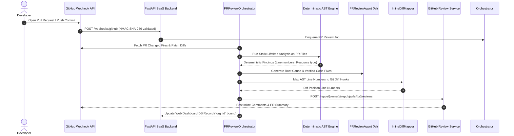

# 🔬 LeakGuard Complete Technical Architecture & Code Specification

---

## 📌 Executive Summary

**LeakGuard** is a commercial-grade, multi-tenant static analysis and AI-driven code security platform engineered to detect, score, explain, and automatically repair Python resource lifecycle vulnerabilities (unclosed database handles, sockets, subprocesses, locks, files, HTTP sessions, and temporary files).

The system enforces a strict **separation of responsibilities**:
1. **Deterministic Core Engine (100% AST Authority)**: Acts as the sole authority for identifying resource leaks, operating purely via static graph analysis without ever executing user source code.
2. **AI Multi-Agent & CodeRabbit PR Review Engine**: Operates as a security reviewer, root cause analyzer, and fix generator. Every patch generated by AI is **sandboxed and deterministically verified** by the AST engine before receiving a `VERIFIED_FIX` classification.

---

## 📂 Repository Code Map & System Layout

```
c:\LeakGaurd\
├── core\                        # Deterministic Static Analysis Subsystem (100% Offline AST Authority)
│   ├── analysis\                # AnalysisEngine & Scanner Pipeline (engine.py, scanner.py)
│   ├── ast\                     # Python AST Visitors & Collectors (visitor.py, collector.py)
│   ├── cfg\                     # Control Flow Graph Builder & Basic Blocks (builder.py, model.py)
│   ├── common\                  # Models, Data Enums & Config (models.py, config.py)
│   ├── dataflow\                # Intra-procedural Path Dataflow Solver (solver.py, lattice.py)
│   ├── ownership\               # Resource Ownership Graph Visualizer (graph.py)
│   ├── parser\                  # Safe stdlib ast.parse wrapper & depth validator (parser.py)
│   ├── resources\               # Resource Catalog & Signature Matchers (catalog.py, signatures.py)
│   ├── risk\                    # Bounded 0-100 Deterministic Risk Scoring Formula (scorer.py)
│   ├── rules\                   # Static Analysis Security Rules (LEAK_001 - LEAK_008)
│   ├── scopes\                  # Lexical & Functional Scope Hierarchy Manager (scopes.py)
│   ├── symbols\                 # Symbol Tables & Variable Trackers (symbols.py)
│   └── whatif\                  # Static Hypothetical Exception Simulator (simulator.py)
│
├── services\                    # Business Logic, AI Agents, & Integration Services
│   ├── ai\                      # Multi-Agent Orchestration & AST Sandbox Verification
│   │   ├── agents\              # Specialized AI Agents (pr_review_agent.py, reviewer.py, fix_gen.py)
│   │   ├── auto_fixer.py        # Strategy-pattern Auto Fixer Engine
│   │   ├── orchestrator.py      # LangFuse Multi-Agent Task Pipeline Execution Engine
│   │   ├── prompts.py           # Structured Prompt Templates for LLM Context
│   │   ├── redactor.py          # Automatic API Key & Secret Redaction Pre-processor
│   │   ├── remediator.py        # AIRemediator for single-file patch synthesis
│   │   ├── tracer.py            # LangFuse & Local Telemetry Logging Tracer
│   │   └── validator.py         # Isolated AST Sandbox 9-Step Patch Validator
│   │
│   ├── github_pr\               # CodeRabbit-Style GitHub PR Review Layer
│   │   ├── comment_builder.py   # Formats rich markdown inline diff & PR summary comments
│   │   ├── inline_mapper.py    # Maps AST findings to Git diff line numbers (Hunk parser)
│   │   ├── orchestrator.py      # PRReviewOrchestrator (PR fetch -> AST -> AI -> GitHub post)
│   │   └── risk_scorer.py       # Composite PR Risk Scoring Engine
│   │
│   ├── saas\                    # SaaS Control Plane Utilities & Log Sync
│   │   └── sync.py              # Uploads findings metadata to SaaS backend
│   │
│   └── voice\                   # System Voice Audio Engine
│       └── announcer.py         # Pyttsx3 / SAPI5 / Windows Speech TTS Announcer
│
├── packages\                    # Reusable Libraries & SaaS Server Backend
│   ├── github\                  # Standardized GitHub REST & GraphQL API Client
│   │   ├── auth.py              # GitHub App Installation & Personal Access Token Auth
│   │   ├── client.py            # GithubClient HTTP Client with Retry & Rate Limiting
│   │   └── services\            # Pull Request, Commit, Review, and Webhook Services
│   │       ├── commit.py        # Git Commit Diff Service
│   │       ├── pull_request.py  # GitHub PR Diff & Files Service
│   │       ├── repository.py    # Repo Connection & Webhook Setup Service
│   │       ├── review.py        # GitHub Review & Comment Creation Service
│   │       └── webhook.py       # HMAC SHA-256 Webhook Verification Service
│   │
│   └── saas\                    # FastAPI SaaS Server Backend
│       ├── app.py               # Main FastAPI Application Initialization
│       ├── config.py            # SaaS Settings & Environment Config
│       ├── db\                  # Database Models & Alembic Migrations
│       │   ├── database.py      # SQLAlchemy Async Engine & Session Manager
│       │   └── models.py        # User, Org, Repo, PRScan, Finding, AgentTrace DB Models
│       └── routers\             # API Endpoint Controllers
│           ├── auth.py          # User Login, Signup & Token Verification
│           ├── github_pr.py     # Trigger PR Reviews & Query PR Scans Endpoint
│           ├── scans.py         # Local CLI Scan Metadata Ingestion Endpoint
│           └── webhooks.py      # GitHub Event Webhook Ingestion Controller
│
├── presentation\                # User Interfaces (Terminal, Web, Reports)
│   ├── dashboard\               # Commercial Next.js 14 Frontend Web Application
│   │   └── src\
│   │       ├── app\             # Next.js App Router (dashboard, pull-requests, scans, login)
│   │       ├── components\      # UI Components (Sidebar, PRStatusBadge, FindingCard)
│   │       └── lib\             # API Client for SaaS Backend Communication
│   ├── json\                    # JSON Report Exporter (exporter.py)
│   ├── sarif\                   # SARIF 2.1.0 Specification Exporter (exporter.py)
│   └── terminal\                # Rich Terminal Formatting & Live Resource Radar UI (formatter.py)
│
├── interfaces\                  # Execution Interfaces (CLI, Pre-commit, GitHub Action)
│   ├── cli\                     # Typer CLI Entry Point & Command Implementations
│   │   ├── firewall_cli.py     # Firewall Policy & PR-Diff CLI Controllers
│   │   ├── main.py              # Core CLI Router & Command Registry (`leakguard`)
│   │   ├── phase16_cli.py       # Risk, Ownership Graph & What-If Simulator CLI Controllers
│   │   ├── review.py            # Review, Explain, Fix, & Verify CLI Controllers
│   │   └── watch.py             # Real-Time Terminal File Monitor Controller
│   ├── github_action\           # GitHub Actions Custom Action Metadata (action.yml)
│   └── precommit\               # Pre-commit Hook Wrapper
│
└── tests\                       # Comprehensive Automated Test Suite
    ├── unit\                    # 61+ Unit Tests (GitHub Client, Orchestrator, AI, AST)
    └── integration\             # Full Integration Scenarios
```

---

## ⚙️ Core Technical Approaches & Algorithms

### 1. Deterministic AST Analysis & CFG Dataflow Equations

LeakGuard parses source code into Python `ast.AST` nodes without importing module dependencies. It builds an **Intra-procedural Control Flow Graph (CFG)** comprising basic blocks $B$ connected by directed edges (Normal, True Branch, False Branch, Exceptional Path, Finally Block).

#### Dataflow Fixed-Point Solver Equations:
For each basic block $B$ in function $F$:

$$\text{IN}[B] = \bigcup_{P \in \text{Pred}(B)} \text{OUT}[P]$$

$$\text{OUT}[B] = \text{gen}(B) \cup (\text{IN}[B] \setminus \text{kill}(B))$$

Where:
- $\text{gen}(B)$: Resource acquisitions introduced in block $B$ (e.g. `conn = sqlite3.connect(...)`).
- $\text{kill}(B)$: Explicit resource release statements in block $B$ (e.g. `conn.close()`, or exiting a `with` block).

#### Resource State Transition Lattice:
```
                 ┌────────────────┐
                 │  UNACQUIRED    │
                 └───────┬────────┘
                         │ (Resource Acquisition Call)
                         ▼
                 ┌────────────────┐
                 │ OPEN_MUST_CLOSE│
                 └───┬────────┬───┘
     (Explicit Close)│        │ (Path Exits Scope without Close)
                     ▼        ▼
       ┌────────────────┐  ┌────────────────┐
       │     CLOSED     │  │ LEAKED / MAYBE │
       └────────────────┘  └────────────────┘
```

---

### 2. Multi-Agent AI Engine Architecture

Located in `services/ai/`, the multi-agent system processes deterministic AST findings to generate human-readable explanations, security impact analyses, and fixes.

#### Multi-Agent Roster & Responsibility:

| Agent Name | Source File | Purpose | Technical Output |
| :--- | :--- | :--- | :--- |
| **ResourceHunterAgent** | `services/ai/agents/hunter.py` | Scans functions for unclosed resources & escape handles. | Candidate leak list |
| **CodeReviewerAgent** | `services/ai/agents/reviewer.py` | Performs qualitative review of code context. | Code style & safety notes |
| **RootCauseAgent** | `services/ai/agents/root_cause.py` | Analyzes execution paths to pinpoint missing cleanup. | Plain language root cause |
| **FixGeneratorAgent** | `services/ai/agents/fix_gen.py` | Synthesizes strategy-pattern fixes (ContextManager, TryFinally). | Candidate Python code patch |
| **VerificationAgent** | `services/ai/agents/verifier.py` | Inspects verification output from AST Sandbox. | Patch safety verdict |
| **PRReviewAgent** | `services/ai/agents/pr_review_agent.py` | Formats inline PR diff comments & executive summary. | GitHub Markdown payload |

#### Secret Redaction Engine (`services/ai/redactor.py`):
Before any code context is passed to external LLM providers (OpenAI, Ollama), `SecretRedactor` scrubs sensitive data using regex patterns and Shannon entropy evaluation:
```python
# API Keys, AWS Secret Keys, Bearer Tokens, Passwords, DB Passwords are masked as:
"[REDACTED_API_KEY]"
"[REDACTED_DATABASE_URL]"
```

---

### 3. Isolated AST Sandbox Patch Verification

Located in `services/ai/validator.py`, this engine enforces **authoritative isolated verification**:

```
          [ Candidate AI Patch Code ]
                      │
                      ▼
        [ Step 1: Python AST Parsing ] ─────(SyntaxError)────► [ REJECT: Invalid Syntax ]
                      │
                      ▼
     [ Step 2: Isolated Memory Workspace ]
                      │
                      ▼
     [ Step 3: Re-Analyze Target File ]
                      │
                      ▼
   [ Step 4: Re-Run Deterministic Engine ]
                      │
        ┌─────────────┴─────────────┐
        ▼                           ▼
[ Target Leak Cleared? ]   [ New Leaks Introduced? ]
    NO ──► [ REJECT ]          YES ──► [ REJECT ]
    │                           │
    └───────────┬───────────────┘
                ▼ (YES & NO)
      [ Mark VERIFIED_FIX ]
```

---

### 4. CodeRabbit-Style GitHub PR Review Pipeline

Located in `services/github_pr/` and `packages/github/`, this pipeline connects GitHub PR webhooks to AST analysis and inline GitHub comments.



---

### 5. Bounded 0–100 Risk Scoring Engine (`core/risk/scorer.py`)

LeakGuard evaluates composite resource security risk without non-deterministic AI variance:

$$\text{Risk Score} = \min\left(100, \sum_{i=1}^{N} \left( W_{\text{resource}}(i) \times M_{\text{severity}}(i) \times M_{\text{exposure}}(i) \right) \right)$$

#### Parameter Tables:
- **Resource Weight $W_{\text{resource}}$**:
  - `DATABASE`: 85
  - `SOCKET`: 80
  - `SUBPROCESS`: 75
  - `LOCK`: 70
  - `HTTP`: 65
  - `FILE`: 50
  - `TEMPFILE`: 40
- **Severity Multiplier $M_{\text{severity}}$**:
  - `CRITICAL`: 1.2
  - `ERROR`: 1.0
  - `WARNING`: 0.7
  - `INFO`: 0.4
- **Exposure Multiplier $M_{\text{exposure}}$**:
  - `DEFINITE_LEAK`: 1.0 (Leak on main execution path)
  - `POTENTIAL_LEAK`: 0.7 (Leak on conditional/exception branch)
  - `SAFE`: 0.0

---

## 🛠️ Complete CLI Command Code Map

Below is the exact code mapping showing **where each CLI command is implemented**:

| CLI Command | Code File Path | Core Handler Function | Key Line Reference |
| :--- | :--- | :--- | :--- |
| `leakguard scan` | [interfaces/cli/main.py](file:///c:/LeakGaurd/interfaces/cli/main.py#L42) | `scan()` | L43–L184 |
| `leakguard pr` | [interfaces/cli/main.py](file:///c:/LeakGaurd/interfaces/cli/main.py#L1154) | `pr_review_cmd()` | L1155–L1333 |
| `leakguard watch` | [interfaces/cli/watch.py](file:///c:/LeakGaurd/interfaces/cli/watch.py#L25) | `run_watch_mode()` | L26–L180 |
| `leakguard review` | [interfaces/cli/review.py](file:///c:/LeakGaurd/interfaces/cli/review.py#L20) | `run_review_cmd()` | L21–L95 |
| `leakguard explain` | [interfaces/cli/review.py](file:///c:/LeakGaurd/interfaces/cli/review.py#L98) | `run_explain_cmd()` | L99–L140 |
| `leakguard fix` | [interfaces/cli/review.py](file:///c:/LeakGaurd/interfaces/cli/review.py#L143) | `run_fix_cmd()` | L144–L210 |
| `leakguard verify` | [interfaces/cli/review.py](file:///c:/LeakGaurd/interfaces/cli/review.py#L213) | `run_verify_cmd()` | L214–L265 |
| `leakguard firewall` | [interfaces/cli/firewall_cli.py](file:///c:/LeakGaurd/interfaces/cli/firewall_cli.py#L15) | `run_firewall_cmd()` | L16–L80 |
| `leakguard pr-diff` | [interfaces/cli/firewall_cli.py](file:///c:/LeakGaurd/interfaces/cli/firewall_cli.py#L83) | `run_pr_diff_cmd()` | L84–L145 |
| `leakguard risk` | [interfaces/cli/phase16_cli.py](file:///c:/LeakGaurd/interfaces/cli/phase16_cli.py#L15) | `run_risk_cmd()` | L16–L65 |
| `leakguard ownership` | [interfaces/cli/phase16_cli.py](file:///c:/LeakGaurd/interfaces/cli/phase16_cli.py#L68) | `run_ownership_cmd()` | L69–L125 |
| `leakguard what-if` | [interfaces/cli/phase16_cli.py](file:///c:/LeakGaurd/interfaces/cli/phase16_cli.py#L128) | `run_what_if_cmd()` | L129–L180 |
| `leakguard init` | [interfaces/cli/main.py](file:///c:/LeakGaurd/interfaces/cli/main.py#L402) | `init()` | L403–L522 |
| `leakguard install` | [interfaces/cli/main.py](file:///c:/LeakGaurd/interfaces/cli/main.py#L729) | `install()` | L730–L735 |
| `leakguard activate` | [interfaces/cli/main.py](file:///c:/LeakGaurd/interfaces/cli/main.py#L736) | `activate()` | L737–L742 |
| `leakguard github connect` | [interfaces/cli/main.py](file:///c:/LeakGaurd/interfaces/cli/main.py#L933) | `github_connect()` | L934–L983 |
| `leakguard github test` | [interfaces/cli/main.py](file:///c:/LeakGaurd/interfaces/cli/main.py#L985) | `github_test()` | L986–L1015 |
| `leakguard server` | [interfaces/cli/main.py](file:///c:/LeakGaurd/interfaces/cli/main.py#L193) | `server()` | L194–L202 |
| `leakguard dashboard` | [interfaces/cli/main.py](file:///c:/LeakGaurd/interfaces/cli/main.py#L745) | `dashboard()` | L746–L753 |
| `leakguard upload` | [interfaces/cli/main.py](file:///c:/LeakGaurd/interfaces/cli/main.py#L205) | `upload()` | L206–L229 |
| `leakguard login` | [interfaces/cli/main.py](file:///c:/LeakGaurd/interfaces/cli/main.py#L322) | `login()` | L323–L393 |
| `leakguard logout` | [interfaces/cli/main.py](file:///c:/LeakGaurd/interfaces/cli/main.py#L395) | `logout()` | L396–L400 |
| `leakguard benchmark` | [interfaces/cli/main.py](file:///c:/LeakGaurd/interfaces/cli/main.py#L186) | `benchmark()` | L187–L190 |
| `leakguard speak` | [interfaces/cli/main.py](file:///c:/LeakGaurd/interfaces/cli/main.py#L903) | `speak()` | L904–L912 |
| `leakguard version` | [interfaces/cli/main.py](file:///c:/LeakGaurd/interfaces/cli/main.py#L914) | `version()` | L915–L918 |

---

## 🗄️ Database Schemas & Multi-Tenancy (`packages/saas/db/models.py`)

LeakGuard enforces multi-tenant organization isolation (`Organization.id`) across all entities:

```
┌─────────────────┐       1:N       ┌─────────────────┐
│  Organization   │ ───────────────► │ User            │
└────────┬────────┘                 └─────────────────┘
         │ 1:N
         ▼
┌─────────────────┐       1:N       ┌─────────────────┐
│ GithubRepository│ ───────────────► │ PullRequestScan │
└─────────────────┘                 └────────┬────────┘
                                             │ 1:N
                                             ▼
                                    ┌─────────────────┐
                                    │ Finding         │
                                    └─────────────────┘
```

---

## 🧪 Technical Verification & Testing Strategy

To ensure absolute reliability, LeakGuard maintains 61 unit and integration test suites:

- **AST Engine Unit Tests**: `tests/unit/test_analyzer.py`
- **GitHub Client & Auth Tests**: `tests/unit/test_github_client.py`
- **Webhook Ingestion Tests**: `tests/unit/test_github_webhook.py`
- **PR Review Orchestration Tests**: `tests/unit/test_pr_review_orchestrator.py`
- **AST Sandbox Patch Fix Tests**: `tests/unit/test_pr_fix_workflow.py`

Run all automated unit tests with coverage:
```bash
pytest --cov=core --cov=services --cov=packages tests/
```
